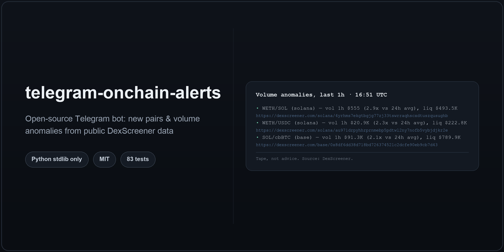

# telegram-onchain-alerts

[](https://github.com/klimogeny1-cmd/telegram-onchain-alerts/actions/workflows/tests.yml)



A small, self-hosted Telegram bot that posts an on-chain "tape" to a channel: new
trading pairs and unusual volume, pulled from the public [DexScreener](https://dexscreener.com)
API. Built as an open template for crypto projects and developers - read it, run it,
fork it.

## What this is

- A **market tape**: new pairs and volume anomalies, on a schedule, with plain factual
  numbers (liquidity, volume, pair age).
- **Rule-based flags**, not a rating: a handful of simple, documented rules over public
  metrics (e.g. "liquidity under $25,000"), clearly labeled as rules - never a score.
- **Public data only**: everything comes from DexScreener's public API. No wallet, no
  private RPC, no on-chain write access of any kind.

## What this is NOT

- **Not trading signals.** No buy/sell calls, no "entry/exit", no price targets.
- **Not financial advice.** Every post ends with a disclaimer, on purpose, every time.
- **Not custody.** The bot never touches a wallet, a private key, or a seed phrase - it
  has no code path that could, because it never asks for one.
- **Not a full-chain firehose.** DexScreener's public API does not expose "every pair
  created on chain X" as a single feed; see [How pair discovery works](#how-pair-discovery-works)
  for what this bot actually does instead, and why.

## Example post

New pairs (illustrative):

```
New pairs, last 60 min · 14:32 UTC

• BONK2/SOL (solana) — liq $38.2K, vol 1h $9.4K, age 12m ⚠️ Very new pair (12 min old)
  https://dexscreener.com/solana/...
• FROG/WETH (base) — liq $61.0K, vol 1h $2.1K, age 47m
  https://dexscreener.com/base/...

Tape, not advice. Source: DexScreener.
```

Volume anomalies (real output from a `--dry-run` test run against the live API):

```
Volume anomalies, last 1h · 16:51 UTC

• WETH/SOL (solana) — vol 1h $555 (2.9x vs 24h avg), liq $493.5K
  https://dexscreener.com/solana/4yrhms7ekgtbgjg77zj33tswrraqhscxdtuszqusughb
• WETH/USDC (solana) — vol 1h $20.9K (2.3x vs 24h avg), liq $222.8K
  https://dexscreener.com/solana/au971drpyhhrprnmebp5pdtwl2ny7nofb5vybjdjkr2e
• SOL/cbBTC (base) — vol 1h $91.3K (2.1x vs 24h avg), liq $789.9K
  https://dexscreener.com/base/0x8df6dd38d718bd726374521c2dcfe90eb9cb7d43

Tape, not advice. Source: DexScreener.
```

A pair only shows a `⚠️` line when one of the rule-based flags in [Risk flags](#risk-flags-rule-based-not-advice)
fires for it - most pairs in a healthy market have none.

## Quick start

1. **Get a bot token.** Message [@BotFather](https://t.me/BotFather) on Telegram,
   `/newbot`, and copy the token it gives you. Add the bot as an admin of the channel
   you want it to post to (it only needs permission to post messages).
2. **Configure.**
   ```
   cp .env.example .env
   ```
   Edit `.env`: fill in `BOT_TOKEN` and `CHANNEL_ID` (your channel's `@username`, or its
   numeric id). The defaults for everything else are reasonable to start with.
3. **Check the config - no network, no Telegram call:**
   ```
   python3 main.py --check
   ```
4. **Run the tests** (see [Tests](#tests) - should finish in well under a second):
   ```
   python3 -m unittest discover -v
   ```
5. **Try it for real, without posting anything**, then run it for real:
   ```
   python3 main.py --dry-run --once     # calls the real DexScreener API, prints instead of sending
   python3 main.py --once               # calls the real DexScreener API AND posts to your channel
   python3 main.py                      # runs forever, one cycle every INTERVAL_MIN minutes
   ```

No `pip install` is required (see [Dependencies](#dependencies)); Python 3.9+ is enough.

## Configuration

Every setting lives in `.env` (see `.env.example` for the full, commented list; only the
two required ones and the most common ones are repeated here).

| Variable | Default | Meaning |
|---|---|---|
| `BOT_TOKEN` | *(required)* | From @BotFather. Never logged or printed - see [Secrets](#secrets). |
| `CHANNEL_ID` | *(required)* | `@channel_username` or a numeric chat id. |
| `CHAINS` | `solana` | Comma-separated DexScreener chain ids to watch. |
| `INTERVAL_MIN` | `60` | Minutes between cycles; also the default "new pair" window. |
| `MIN_LIQUIDITY_USD` | `5000` | Hard floor - pairs below this (or with unknown liquidity) are dropped before analysis. |
| `DISCOVERY_QUERIES` | *(built-in per-chain hints)* | Search terms used to find candidate pairs; see below. |
| `WATCHLIST` | *(empty)* | `chain:tokenAddress,...` - a project's own token(s), always checked directly. |
| `VOLUME_SPIKE_RATIO` | `3` | 1h volume vs. flat 24h hourly average, to count as a "spike". |
| `MIN_VOLUME_USD_FOR_SPIKE` | `1000` | Floor so dust volume never counts as a "spike". |
| `RISK_LOW_LIQUIDITY_USD` | `25000` | Below this, a pair gets a "Low liquidity" flag (separate from the harder `MIN_LIQUIDITY_USD` cutoff above). |
| `RISK_NEW_PAIR_MIN` | `30` | Below this age (minutes), a pair gets a "Very new pair" flag. |
| `RISK_VOL_LIQ_RATIO` | `5` | Above this 24h-volume-to-liquidity ratio, a pair gets a "High volume vs liquidity" flag. |

Everything else (post size cap, HTTP timeout, request pacing, cache lifetime, log level,
where the dedup database lives) has a working default - see `.env.example`.

## How pair discovery works

DexScreener's public API is search- and lookup-oriented - there is no single endpoint
that means "every pair created on chain X in the last N minutes". So this bot builds
that itself, honestly, out of the pieces the API does offer:

1. For each chain in `CHAINS`, it calls `GET /latest/dex/search?q=<term>` with a search
   term likely to surface a lot of pairs on that chain (its native/major quote token,
   e.g. `SOL` for Solana, `WETH` for most EVM chains - see `DEFAULT_CHAIN_QUERY_HINTS` in
   `alerts_bot/runner.py`, or override with `DISCOVERY_QUERIES`).
2. Results are filtered down to the configured chain (the search endpoint returns
   matches across *all* chains), deduplicated by pair address, and passed through
   `MIN_LIQUIDITY_USD`.
3. Anything left in `WATCHLIST` is fetched directly via
   `GET /token-pairs/v1/{chainId}/{tokenAddress}` and merged in - useful for a project
   that wants its *own* token reliably covered regardless of what the search terms
   happen to surface that cycle.
4. "New" = `pairCreatedAt` inside the last `NEW_PAIR_WINDOW_MIN`; "volume anomaly" = 1h
   volume at least `VOLUME_SPIKE_RATIO` times the flat 24h hourly average, above the
   `MIN_VOLUME_USD_FOR_SPIKE` floor. Both live in `alerts_bot/analysis.py`.

Practically: this surfaces a solid slice of chain activity, especially with a `WATCHLIST`
entry for anything you specifically care about, but it is not - and cannot honestly claim
to be - a complete real-time index of every pair on a chain.

## Data source & rate limits

Checked directly against `docs.dexscreener.com` and the live API on **2026-09-24**:

- **No API key.** Calling `/latest/dex/search`, `/token-pairs/v1/{chainId}/{tokenAddress}`,
  `/tokens/v1/{chainId}/{tokenAddresses}` and `/latest/dex/pairs/{chainId}/{pairId}`
  directly (no auth headers beyond a `User-Agent`) returned normal `200` responses.
- **Rate limit:** the docs state "60 requests per minute" for a *neighbouring* family of
  endpoints (`/token-profiles/*`, `/ads/latest/v1`, `/metas/*`). No explicit number is
  published for the search/pairs endpoints this bot actually uses, and five back-to-back
  requests during the check returned plain `200`s with no rate-limit headers.
- **No Terms of Service or usage policy page was found** linked from the docs site (root,
  FAQ, and API reference pages were checked).

Absent a published number for the endpoints this bot calls, it does not assume "no
limit" - `alerts_bot/dexscreener.py`'s `RateLimiter` keeps requests at least
`MIN_REQUEST_INTERVAL_SEC` (default 1.2s, ≈50/min) apart, and its `Cache` (default 60s
TTL) avoids repeating an identical request within one cycle. With the default
`INTERVAL_MIN=60` and a short chain list, a real cycle makes a handful of requests per
hour, not per second - this is a periodic tape, not a scraper. If you widen `CHAINS`,
lower `INTERVAL_MIN` a lot, or add a long `WATCHLIST`, re-check the docs above before
lowering `MIN_REQUEST_INTERVAL_SEC`.

If DexScreener's terms change to require a key or prohibit this kind of use, this is the
section to update - and the client to point at a different source or pause.

## Risk flags (rule-based, not advice)

`alerts_bot/risk_flags.py` computes a short list of factual flags from public metrics,
nothing else:

- **Liquidity unknown** - DexScreener did not report it (common for very new pairs); the
  bot never treats "unknown" as "fine".
- **Low liquidity** - below `RISK_LOW_LIQUIDITY_USD`.
- **Very new pair** - younger than `RISK_NEW_PAIR_MIN`.
- **High 24h volume vs liquidity** - 24h volume is at least `RISK_VOL_LIQ_RATIO` times
  liquidity (can indicate low depth relative to trading activity - a fact, not a
  verdict).

These do not add up to a score, and an **empty flag list is not a claim that a pair is
safe** - it only means none of these four specific rules fired. Every post carries the
`Tape, not advice. Source: DexScreener.` footer for exactly this reason; if you extend
this template, keep that pairing intact.

## Deduplication

`alerts_bot/dedup.py` keeps a small SQLite database (default `state/seen.db`) so a
restart, or a network retry, never reposts the same thing:

- A **new pair** alert is sent at most once per pair, ever - a pair is only "new" once.
- A **volume spike** alert is sent at most once per pair per UTC clock hour, so a pair
  that keeps spiking can be reported again later without repeating every single cycle
  inside the same hour.

## Secrets

`BOT_TOKEN` is read only from `.env` (never from the process environment, so a token left
in a shell from another project can't leak in by accident) and is scrubbed from every log
line by `alerts_bot/telegram.TokenFilter`, wired up in `main.py`. `.env` is git-ignored;
never commit it.

## Project layout

```
main.py                                    entry point: --check / --once / --dry-run / loop
alerts_bot/
  config.py           .env loading and validation
  dexscreener.py       DexScreener API client (urllib, rate limit, cache)
  analysis.py          Pair model, new-pair / volume-anomaly detection
  risk_flags.py         rule-based flags over public metrics
  formatter.py          Telegram post text (HTML parse mode)
  telegram.py            Bot API client (sendMessage only)
  dedup.py                SQLite "already posted?" store
  runner.py                one fetch -> analyze -> post cycle
tests/                    unittest suite + tests/fixtures/*.json (no network)
deploy/telegram-onchain-alerts.service     systemd unit
Dockerfile                                  optional container build
.env.example
```

## Tests

Standard library only - no `pytest` needed (though it will run this suite fine too, if
you already have it):

```
python3 -m unittest discover -v
```

All tests run against saved JSON fixtures in `tests/fixtures/` and never touch the
network - see `tests/helpers.py` for the fake HTTP layer used to test
`alerts_bot/dexscreener.py` without a real request.

## Deployment

**systemd** (Linux server) - see `deploy/telegram-onchain-alerts.service` for the full
unit file and install steps in its header comments.

**Docker** (optional) - see `Dockerfile`:
```
docker build -t telegram-onchain-alerts .
docker run -d --name onchain-alerts \
  -v $(pwd)/.env:/app/.env:ro \
  -v onchain-alerts-state:/app/state \
  telegram-onchain-alerts
```

## Dependencies

Standard library only (`urllib`, `sqlite3`, `json`, `argparse`, ...). There is nothing to
install: clone it, configure it, run it.

The one exception is [Pillow](https://python-pillow.org/), needed only to *regenerate*
`docs/preview.png` via `docs/make_preview.py` - never to run the bot.

## License

MIT - see `LICENSE`. Copyright (c) 2026 Gram Works.

---

Need a custom version? Gram Works builds Telegram bots and Mini Apps — t.me/gramworks_hub
