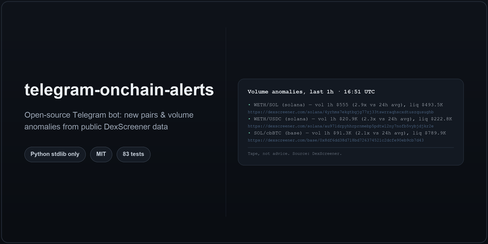

# Solana Tape (telegram-onchain-alerts)

[](https://github.com/klimogeny1-cmd/telegram-onchain-alerts/actions/workflows/tests.yml)

A self-hosted Telegram bot that posts a **live, facts-only on-chain tape** for Solana
mainnet to a channel: large trades, liquidity moving in and out, new pools, launchpad
graduations, volume breakouts, big transfers and burns, top-holder balance changes and
mint/freeze-authority changes - each line with a link you can check on Solscan.

Status: verified against live Solana mainnet data on 2026-09-30 - `--check-live`: Solami RPC
and both Blur streams, over 200 decoded events a minute, no parse errors (see "First live
run"); 235 offline tests. Live demo channel: [@solana_tape_demo](https://t.me/solana_tape_demo).

**Trying it with your own key:** a Solami key is all you need. Put it into `.env` as
`SOLAMI_API_KEY=sk_...` ([Quick start](#quick-start), step 3), then run
`python3 main.py --check-live` (20 s of live mainnet, posts nothing) or
`python3 main.py --dry-run --duration 120` (live posts printed in the terminal) - neither
needs a Telegram bot.

Data comes from **[Solami](https://solami.dev)**: the Blur decoded-event stream is the
real-time backbone, and Solami RPC answers "what is true right now" about a token. No
third-party Python packages - clone, configure, run. Open source (MIT) by Gram Works.

## What this is

- **A tape, not a terminal.** Facts as they confirm on mainnet, batched into readable
  posts (one post per `FLUSH_SEC`, default 60 s), plus an hourly summary per token.
- **Two modes.** `watchlist` - your project's own token(s), everything that happens to
  them. `firehose` - the whole Solana market with high thresholds.
- **Rule-based flags, never a score.** A handful of documented rules over public facts
  ("mint authority active", "removed 30% of the pool's SOL side"), each shown as `⚠️`.
- **Built to run unattended.** Reconnects with backoff, understands Solami's close codes,
  de-duplicates across restarts, retries failed posts, shuts down cleanly, writes a
  heartbeat file.

## What this is NOT

- **Not trading signals.** No buy/sell calls, no targets, no "entries". A trade line says
  what a wallet *did* ("bought $7.5K of DEMO"), never what a reader should do.
- **Not financial advice.** Every post ends with an "On-chain facts, not financial
  advice" line - on every post, not in a pinned message someone may never read.
- **Not custody.** The bot never touches a wallet, a private key or a seed phrase, and
  never signs or sends a transaction. There is no code path that could.
- **Not a verdict on any token.** An empty flag list is not a claim that a token is safe.

## Example posts

Illustrative. The tape post is the real formatter's output for the **synthetic** fixture
frames used by the offline demo (made-up addresses, not a mainnet recording - see
[Try it offline](#try-it-offline-no-key-no-telegram)); the graduation's second line comes
from Solami RPC and appears when a key is set. The summary numbers are made up to show
the layout. In Telegram every address, `tx` and token name is a Solscan link.

```
Solana Tape · 14:32 UTC · watching DEMO

Liquidity (≥ $2.5K or ≥ 10.0% of a pool)
• Prov…1111 removed ≈$44.9K from DEMO/SOL on pumpswap (≈30.0% of the pool's SOL side) · tx ⚠️ Removed 30% of the pool's SOL side

Large trades (≥ $5.0K)
• Trad…1111 bought $7.5K of DEMO at $0.00075 on pumpswap · tx
• Trad…1111 bought $6.1K of DEMO at $0.00087 on raydium_cpmm · tx ⚠️ Price impact 23.5%; Outlier print (kept out of candles by Solami's price guard)

New pools
• New DEMO/USDC pool on meteora_dlmm · pool Pair…1111 · created by Crea…1111 · tx

Graduations
• DEMO graduated from pumpfun to a pumpswap pool (Pair…1111) · tx
  mint authority: none · freeze authority: none · top-10 accounts 23.4% of supply

Volume breakouts
• DEMO: 5-min volume $18.3K, 4.5× its 1-hour baseline · 212 trades · ~131 wallets · mcap at trigger $75.0K (Solami surge)

⚠️ = rule-based flag (README "Rule-based flags"), not a verdict.
On-chain facts, not financial advice. Data: Solami (Blur stream + RPC), Solana mainnet.
```

```
Tape summary DEMO · last 60 min · 15:00 UTC

Trades: 1,284 (702 buys / 582 sells) · 431 wallets
Volume: $1.24M (buys $660.0K / sells $580.0K)
Liquidity: +$120.0K added / -$95.0K removed (net +$25.0K, 12 events)
Last price: $0.00002231 (-3.20% over the window)
Largest trade: $52.3K sell · tx

Counted from Solami Blur swap/liquidity events received while connected.
On-chain facts, not financial advice. Data: Solami (Blur stream + RPC), Solana mainnet.
```

On start, watchlist mode also posts a **"Now watching"** card per token: supply,
decimals, token program, mint authority, freeze authority, Token-2022 extensions, top-10
holder share, and any rule-based flags - all read live over Solami RPC.

## Why Solami - which products do the real work

Solami's own rule of thumb is *"read state with RPC, react to change with a stream"*
(solami.dev/docs/which-product). This bot does exactly that:

| Solami product | Endpoint | What it does in this bot |
|---|---|---|
| **Blur** (decoded market data, WebSocket) | `wss://ws.solami.dev/data/subscribe` | **Every event on the tape.** Typed `swap`, `liquidity`, `pool_create`, `token_create`, `graduation`, `surge`/`radar`, `transfer` and `metadata` events across every major DEX, USD already computed. Server-side filters (`type`, `address`, `min_volume_usd`) mean the bot downloads only what it can post about. |
| **RPC** | `https://rpc.solami.dev/sol` | **Facts that are state, not events.** `getAccountInfo` (jsonParsed) for supply, mint/freeze authority and Token-2022 extensions; Solami's **`getTokenLargestAccountsV2`** for the top-20 holders (Solami retired the stock method); `getMultipleAccounts` for balances and owners of accounts that left the top 20; `getSlot` for the key check. |
| **Data API** (REST, optional) | `https://api.solami.dev/data/token/metadata` | A token's symbol when the stream has not sent its `metadata` event yet. |

How the pieces combine (the part no single endpoint gives you):

- **Graduation + RPC**: when Blur reports a launchpad token graduating to an AMM pool,
  the bot reads the mint over RPC and prints whether the mint and freeze authorities
  are still active, Token-2022 extensions, and the top-10 holder share - right under it.
- **Liquidity + swaps**: Blur liquidity events carry raw amounts; the bot values them with
  the latest prices seen on Blur swaps and sizes them against the pool reserves reported
  by those swaps, which is what makes "removed ≈30% of the pool" possible.
- **Holders + authorities over time**: RPC snapshots are persisted, so a change is
  reported even if it happened while the bot was down.

Not used in v1, on purpose:

- **Yellowstone gRPC / Mirage**: raw `SubscribeUpdate` frames that we would have to
  decode ourselves - exactly the DEX-instruction parsing Blur already does ("if you were
  about to write a DEX instruction parser, use Blur" - Solami docs). gRPC would also need
  `grpcio`/protobuf dependencies.
- **Webhooks**: a good fit for a quiet watchlist; the webhook *stream* is also a
  WebSocket, so it could reuse this client in v2. Creating webhooks needs an account-API
  permission (`WebhooksManage`) that a read-only bot should not require.
- **Beam**: transaction landing. This bot never sends transactions - by design.

## Quick start

Python 3.9+. Nothing to `pip install` (see [Dependencies](#dependencies)).

1. **Get a Solami key.** Sign up at [solami.dev](https://solami.dev) and, under
   *Dashboard -> API keys*, create a **standard key** (`sk_...`) whose role has the
   **`DataApi`** permission - Blur rejects RPC-only and gRPC-only keys. The same key
   works for RPC and the Data API.
2. **Get a bot token.** Message [@BotFather](https://t.me/BotFather), `/newbot`, copy the
   token. Make the bot an admin of your channel (it only needs "Post messages").
3. **Put your own Solami key into `.env`.** The repository ships without any key.
   ```
   cp .env.example .env
   ```
   Open `.env` and fill in:
   ```
   SOLAMI_API_KEY=sk_...        # your own key from step 1
   BOT_TOKEN=123456789:AA...    # from step 2 - not needed for --check-live and --dry-run
   CHANNEL_ID=@your_channel     # the channel the bot posts to
   ```
   For watchlist mode also set `WATCH_MINTS` (your token's mint address); leave it empty
   for the firehose.
4. **Check the config** (no network at all):
   ```
   python3 main.py --check
   ```
5. **Check the key against live mainnet** (one RPC call, 20 s of the Blur stream, prints
   what arrived; posts nothing):
   ```
   python3 main.py --check-live
   ```
6. **Watch it for real without posting**, then run it:
   ```
   python3 main.py --dry-run --duration 300   # live mainnet data, posts printed here
   python3 main.py --announce                  # live, posting; --announce re-posts today's "Now watching" card
   python3 main.py                             # run until stopped (Ctrl-C / SIGTERM stop cleanly)
   ```

### Try it offline (no key, no Telegram)

```
python3 main.py --env examples/offline-demo.conf \
    --replay-file tests/fixtures/solami/blur_frames.jsonl --dry-run
```

Replays **synthetic** Blur frames (hand-built from the documented event shapes, including
a malformed line, an unknown event type and a server error notice) through the real
parser, rules, dedup and formatter, and prints the posts. RPC-backed facts need a key,
so they are skipped offline.

## Configuration

Every setting lives in `.env` (see `.env.example` for the full, commented list). Values
are read **only** from that file, never from the process environment, so a key left in a
shell by another project can't leak in.

| Variable | Default | Meaning |
|---|---|---|
| `BOT_TOKEN` | *(required)* | From @BotFather. Never logged. |
| `CHANNEL_ID` | *(required)* | `@channel_username` or numeric chat id. |
| `SOLAMI_API_KEY` | *(required)* | Standard Solami key with `DataApi`. Never logged - it is scrubbed from every log line and traceback. |
| `TAPE_MODE` | `auto` | `watchlist` if `WATCH_MINTS` is set, else `firehose`. |
| `WATCH_MINTS` | *(empty)* | Comma-separated token mints (watchlist mode). |
| `LARGE_TRADE_USD` | 5,000 / 50,000 | Trade size to post (watchlist / firehose). In firehose mode Blur filters on the server. |
| `LIQ_ALERT_USD` | 2,500 / 50,000 | Liquidity add/remove size to post. |
| `LIQ_ALERT_PCT` | `10` | Watchlist: also post changes of at least this % of the pool's quote reserve (and flag removals). |
| `LIQ_REPORT_ADDS` | true / false | Report adds, not only removals. |
| `SURGE_MIN_MULTIPLE`, `SURGE_MIN_MCAP_USD` | `5`, `250000` | Firehose: minimum breakout multiple and market cap. Watchlist posts every breakout of your token. |
| `HOLDER_CHANGE_PCT` | `0.5` | Watchlist: top-holder changes and transfers/mints/burns of at least this % of supply. |
| `TOP10_FLAG_PCT`, `PRICE_IMPACT_FLAG_PCT` | `50`, `10` | Flag thresholds (see below). |
| `FLUSH_SEC` | `60` | Real-time items are batched into one post this often. |
| `MAX_POSTS_PER_MIN` | `6` | Hard cap; posts are spaced evenly. |
| `HOLDERS_POLL_MIN`, `AUTHORITY_RECHECK_MIN` | `5`, `30` | Watchlist RPC checks. |
| `SUMMARY_EVERY_MIN`, `DIGEST_EVERY_MIN` | `60`, `15` | Watchlist summary / firehose launch digest (clock-aligned, `0` = off). |
| `SOLAMI_WS_URL`, `SOLAMI_RPC_URL`, `SOLAMI_API_URL` | global endpoints | Pin a region by prefixing the host with `fra.`, `ams.` or `nyc.`. |
| `SOLAMI_RPC_MAX_RPS` | `4` | Client-side RPC cap (Solami's Free plan allows 5 requests a second, Dev 50, Pro 200). |
| `DATA_SOURCE` | `solami` | `dexscreener` switches to the legacy keyless tape (see below). |

## Modes

**watchlist** (a project's own token(s)) - one Blur subscription filtered to
`WATCH_MINTS` (`type=swap,liquidity,pool_create,token_create,graduation,surge,radar,transfer`).
Posts: large trades; liquidity adds/removes by size or pool share; every new pool and
graduation of the token; every Solami surge/radar breakout; transfers, mints and burns of
at least `HOLDER_CHANGE_PCT` of supply; top-20 holder balance changes (RPC poll every
`HOLDERS_POLL_MIN`); mint/freeze authority and Token-2022 changes (RPC re-check every
`AUTHORITY_RECHECK_MIN`); an hourly summary (trades, buy vs sell count and volume,
unique wallets, liquidity in/out, last price and change, largest trade); a "Now watching"
card on start (once per UTC day, or with `--announce`).

**firehose** (the whole market) - two Blur subscriptions, because a type-specific filter
such as `min_volume_usd` makes Blur return *only* swaps:
`market` (`type=liquidity,pool_create,token_create,graduation,surge,radar`) and
`large-trades` (`type=swap&min_volume_usd=LARGE_TRADE_USD`, filtered on Solami's side).
Posts: whale trades; large liquidity removals; every graduation with mint/freeze
authority and top-10 share read over RPC; big breakouts; a launch digest every
`DIGEST_EVERY_MIN` (new tokens, new pools and graduations by venue, plus stream health).

## Rule-based flags (not advice)

Each rule checks one publicly verifiable fact (`alerts_bot/tape/flags.py`):

| Flag | Fires when | Source |
|---|---|---|
| Mint authority active | the mint has a mint authority - supply can still grow | RPC `getAccountInfo` |
| Freeze authority active | the mint has a freeze authority - accounts can be frozen | RPC `getAccountInfo` |
| Token-2022 permanent delegate / transfer fee / transfer hook / default frozen / paused / non-transferable | the extension is present (fee > 0, paused = true, ...) | RPC `getAccountInfo` |
| Top-10 concentration | top-10 holder accounts hold >= `TOP10_FLAG_PCT` of supply (can include pools and exchanges) | RPC `getTokenLargestAccountsV2` |
| Price impact | a trade's `price_impact_pct` >= `PRICE_IMPACT_FLAG_PCT` | Blur `swap` |
| Outlier print | Solami's price guard marked the trade `candle_ok: false` | Blur `swap` |
| Large removal | a removal >= `LIQ_ALERT_PCT` of the pool's quote-side reserve | Blur `liquidity` + reserves from Blur swaps |

The flags do not add up to a score, and a token with no flags has not been declared safe.

## Architecture

```
                         Solana mainnet
                               |
        +----------------------+-----------------------+
        |                   Solami                     |
        |  Blur WebSocket         RPC          Data API (optional)
        |  /data/subscribe        /sol         /data/token/metadata
        +--------+----------------+-------------+------+
                 | decoded events | point reads |
   +-------------v-----------+ +--v-------------v-------------+
   | solami/websocket.py     | | solami/rpc.py                |
   |  RFC 6455 client, TLS   | |  getAccountInfo (jsonParsed) |
   | solami/blur.py          | |  getTokenLargestAccountsV2   |
   |  1 thread per socket,   | |  getMultipleAccounts, getSlot|
   |  backoff + close codes  | |  RPS cap, retry -32005/429   |
   | solami/events.py        | | solami/data_api.py           |
   |  typed, tolerant parser | +--------------+---------------+
   +-------------+-----------+                |
                 | queue                      |
   +-------------v----------------------------v---------------+
   | tape/engine.py   rules, batching, summaries, holders,    |---- dedup.py (SQLite):
   |                  authorities; confirm-after-send         |     sent items + snapshots
   | tape/state.py    metadata, prices, pool reserves, stats  |
   | tape/flags.py    rule-based flags                        |
   | tape/format.py   Telegram HTML, escaping, length limits  |
   +-------------+--------------------------------------------+
                 | posts, every FLUSH_SEC
   +-------------v-------------+
   | tape/loop.py  run loop,   |---- state/heartbeat.json, SIGTERM/SIGINT
   |  publisher (posts/min cap)|
   | telegram.py   sendMessage |
   +---------------------------+
```

## Reliability

- **Reconnects**: every Blur subscription runs in its own thread and reconnects on its
  own - exponential backoff with full jitter (1 s .. 60 s), reset after a stable minute.
  Close codes are read, not guessed: `1001` (node restart) -> reconnect in 1 s; `4002`
  (bandwidth and balance empty) and HTTP 401/403 (key rejected) -> retry every 5 min
  with a clear log line; `4029` (stream limit) -> back off >= 60 s.
- **Liveness**: the client pings after 20 s of silence and drops the connection after
  90 s without data or pong. Server pings are answered.
- **One bad event never stops the loop**: the parser never raises (unknown event types
  are counted and ignored, as Solami's docs ask), and the loop catches per-event errors.
- **No duplicates, no lost facts**: items are recorded as sent only after Telegram
  confirms; a failed send is retried on the next flush (3 attempts). SQLite dedup
  survives restarts; `--dry-run` uses a separate state file.
- **Rate limits**: RPC is capped client-side (`SOLAMI_RPC_MAX_RPS`) and retries `-32005`
  / HTTP 429 with exponential backoff and jitter, as Solami's error guide asks; Telegram
  posts are capped per minute and 429s honour `retry_after`.
- **Graceful shutdown**: SIGTERM/SIGINT stop reading, close each socket with a proper
  close frame, flush queued items and exit (systemd `TimeoutStopSec=30`, `docker stop`).
- **Heartbeat**: `state/heartbeat.json` is rewritten every 30 s with per-stream health
  (connected, messages, reconnects, last error); the Docker image has a HEALTHCHECK on it.

## How to verify the facts

Every line carries its evidence:

- **Trades, liquidity, pools, graduations, transfers**: the `tx` link opens the
  transaction on Solscan - amounts, wallet and pool are all there.
- **USD values** of trades are Blur's own `volume_usd` / `price_usd`. Liquidity values
  are estimates marked `≈`: the legs valued at the latest Blur prices (one priced leg is
  doubled, exact for constant-product pools). Pool share = the event's quote amount /
  the pool's quote reserve before it.
- **Authorities and extensions**: ask any Solana RPC yourself -
  `curl -s "https://rpc.solami.dev/sol?api_key=$SOLAMI_API_KEY" -H 'Content-Type: application/json' -d '{"jsonrpc":"2.0","id":1,"method":"getAccountInfo","params":["<MINT>",{"encoding":"jsonParsed"}]}'`
  and read `mintAuthority` / `freezeAuthority` / `extensions`.
- **Top holders** are *token accounts* (they can be pool vaults or exchanges); compare
  with the Solscan "Holders" tab.
- **Summaries** count only events received while the bot was connected; a window that
  started mid-hour says "since HH:MM".

## Limits

- **Not low-latency by design**: posts are batched (`FLUSH_SEC`). This is a tape for
  people, not a trading feed.
- **Stream gaps**: events that confirm while a socket is reconnecting are not replayed in
  v1 (Blur's replay mode could backfill a watchlist gap - a v2 item).
- **Top holders** come from a periodic RPC poll (default 5 min), not a stream.
- **Plan limits apply**: Blur streams need a standard key, streaming bandwidth or balance,
  and at most a plan-dependent number of concurrent streams (firehose uses 2). Solami's Free
  plan has no WebSocket connections: run the tape on a trial, a paid plan or pay-as-you-go
  balance (Blur is metered per delivered byte).
- **Facts are only as good as the source**: numbers come from Solana via Solami; every
  line links to Solscan so a reader can cross-check.

## Assumptions to verify with a real key

Solami's docs describe the Blur stream in detail, but a few field names are only shown in
passing. The parser accepts the likely variants and never invents a value, and every
assumption below is visible in one command:

```
python3 main.py --check-live 60 --record state/frames.jsonl
```

It prints the RPC answer for each watched mint, event counts per type, and one raw
example per event type, and appends every raw frame to the file (usable as a test
fixture). Check:

| # | Assumption | Where |
|---|---|---|
| A1 | `liquidity` uses `kind`, `base_mint`, `quote_mint`, `base_amount`, `quote_amount`, `provider`, `pool`, `dex` (swap-style names); a USD field, if any, is picked up from `value_usd`/`volume_usd`/`amount_usd`/`usd` | `solami/events.py` |
| A2 | `pool_create` carries the token as `mint` or `base_mint` (docs and playground differ) | `solami/events.py` |
| A3 | `transfer` has a raw `amount` (and maybe `decimals`) next to `kind`, `mint`, `src_owner`, `dst_owner` | `solami/events.py` |
| A4 | `metadata` has `mint`, `name`, `symbol`, `decimals` flat (a nested `metadata` object also works) | `solami/events.py` |
| A5 | `graduation` has `mint`, `launchpad`, `dex`, `pool` (+ `signature` if present) | `solami/events.py` |
| A6 | swap `price` is quote-token units per base token, so `price_usd / price` = quote USD price (guarded by sanity bounds) | `tape/state.py` |
| R1 | `getTokenLargestAccountsV2` takes `[mint, {commitment}]` and returns `value` or `value.accounts` | `solami/rpc.py` |
| D1 | `GET /data/token/metadata?address=` returns `symbol`/`name` (top level or nested) | `solami/data_api.py` |
| K1 | one standard key with `DataApi` works for Blur, RPC and the Data API | `main.py --check-live` |

Already verified without a key (2026-09-26): the Blur and RPC endpoints answer
`401 {"message":"missing api key"}` / `{"message":"unauthorized"}` to this client, so
the TLS + WebSocket upgrade path and the error handling work against the real hosts.

**First live run (2026-09-30, `--check-live 60`, firehose):** RPC answered, both Blur
subscriptions connected, 216 frames in 60 s, no parse errors. One example of each type is in
`tests/fixtures/solami/live_frames_2026-09-30.jsonl` (`tests/test_solami_live.py`):

| # | What the live frames showed |
|---|---|
| A1 | leg names as assumed; no single USD field - the value comes **per leg** as `base_usd` / `quote_usd` (`"0"` = no price for that token), with post-event reserves. The parser now reads both legs, and a liquidity event is valued even before any swap has given a price |
| A2 | `pool_create` carries both `mint` and `base_mint` (same value) |
| A4 | flat `mint`, `name`, `symbol`, `decimals`; the picture as `logo_uri` and as `image_url` - **`image_url` carries the account's `api_key`** (see "Secrets") |
| A5 | `graduation` has `mint`, `launchpad`, `dex`, `pool`, `creator`, no `signature` |
| - | `surge` / `radar`, `token_create` as documented; `connected` is a stream notice, not posted |

Not seen in 60 s, still to verify: A3 (`transfer` - not subscribed), A6 (no large swap came),
R1 and D1 (no watched mint), and the Data API part of K1.

## Deployment

**systemd** (Linux server): see `deploy/telegram-onchain-alerts.service` - install steps
are in its header. `--check` runs before every start; a config error exits 2 and is not
restarted in a loop.

**Docker**:
```
docker build -t solana-tape .
docker run -d --name solana-tape \
  -v $(pwd)/.env:/app/.env:ro \
  -v solana-tape-state:/app/state \
  solana-tape
```

## Tests

```
python3 -m unittest discover -v
```

235 tests, about 1.5 s, standard library only, **no network**: synthetic and recorded Blur frames and
recorded JSON-RPC shapes in `tests/fixtures/solami/`, a scripted WebSocket server on a
socketpair for the protocol client (`tests/ws_helpers.py`), fake RPC/bot objects for the
engine and the loop. CI (`.github/workflows/tests.yml`) runs them on Python 3.9, 3.11 and
3.13, plus `--check` and the offline demo.

## Secrets

`BOT_TOKEN` and `SOLAMI_API_KEY` are read only from `.env` and scrubbed from every log
line and traceback (`telegram.TokenFilter`). URLs are logged with the key replaced by
`<SOLAMI_API_KEY>`, so a terminal can be screen-recorded safely. `.env` is git-ignored.

Solami's `metadata` frames give the token picture as a link with **your** key in it
(`image_url: .../data/token/image/<mint>?api_key=...`, seen live 2026-09-30). So nothing
leaves the process with a key: every post goes through `telegram.without_secrets`, which
cuts `api_key`, `key`, `token` and similar parameters out of every link and replaces the
bot token and the Solami key wherever they stand; `--dry-run` prints exactly that text;
`--check-live` prints its examples and writes `--record` frames the same way. A recording
made before 2026-09-30 may hold the key: search it for `api_key=` before sharing it.

## Project layout

```
main.py                     entry point: --check / --check-live / --dry-run / --replay-file / run
alerts_bot/
  solami/                   Solami data layer (the only data path in the default mode)
    websocket.py              RFC 6455 client, stdlib only
    blur.py                   Blur subscriptions, reader threads, reconnect/backoff, replay source
    events.py                 typed, tolerant Blur event parser
    rpc.py                    JSON-RPC client: mint facts, top holders, balances
    data_api.py               optional symbol lookup (REST)
  tape/                     the live tape
    engine.py                 rules, batching, summaries, digests, holder/authority tracking
    state.py                  metadata cache, prices, pool reserves, window stats
    flags.py                  rule-based flags
    format.py                 Telegram HTML posts
    loop.py                   run loop, publisher, heartbeat, graceful shutdown
  config.py                 .env loading and validation
  dedup.py                  SQLite: sent items + persisted snapshots
  telegram.py               Bot API client (sendMessage only), secret scrubbing
  dexscreener.py, analysis.py, risk_flags.py, formatter.py, runner.py   legacy DexScreener tape
tests/                      unittest suite + fixtures (no network)
examples/offline-demo.conf  settings for the offline replay
deploy/                     systemd unit
Dockerfile
```

## Legacy DexScreener mode

The original template - new pairs and volume anomalies polled from DexScreener's public
API, no key - still works unchanged with `DATA_SOURCE=dexscreener` (settings at the end
of `.env.example`: `CHAINS`, `INTERVAL_MIN`, `WATCHLIST`, ...; run with `--once` for a
single cycle). It is off by default and uses no Solami product; nothing in the Solami
mode calls DexScreener (posts only link to its chart page).



## Dependencies

Standard library only (`ssl`, `socket`, `urllib`, `sqlite3`, `json`, `threading`, ...).
The WebSocket client is ~440 lines including its docs, in
`alerts_bot/solami/websocket.py`, fully covered by tests, so there is nothing to install and nothing to audit beyond this repository.

The one exception is [Pillow](https://python-pillow.org/), needed only to *regenerate*
`docs/preview.png` via `docs/make_preview.py` - never to run the bot.

## License

MIT - see `LICENSE`. Copyright (c) 2026 Gram Works.

---

Need a custom version? Gram Works builds Telegram bots and Mini Apps — t.me/gramworks_hub
